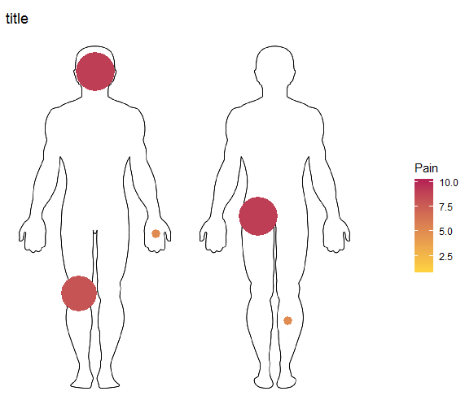

# ggbody

The ggbody package draws a heat-map of events on a human body silhouette.

This package is in early development and has a very limited number of body
locations.

### Installation

    remotes::install_github("TelethonKids/ggbody")

### Example

    #### load ggbody package ----
    
    library(ggbody)
    
    #### create heatmap ----
    
    data(body_pain)
    
    ggbody(body_pain, Pain)

